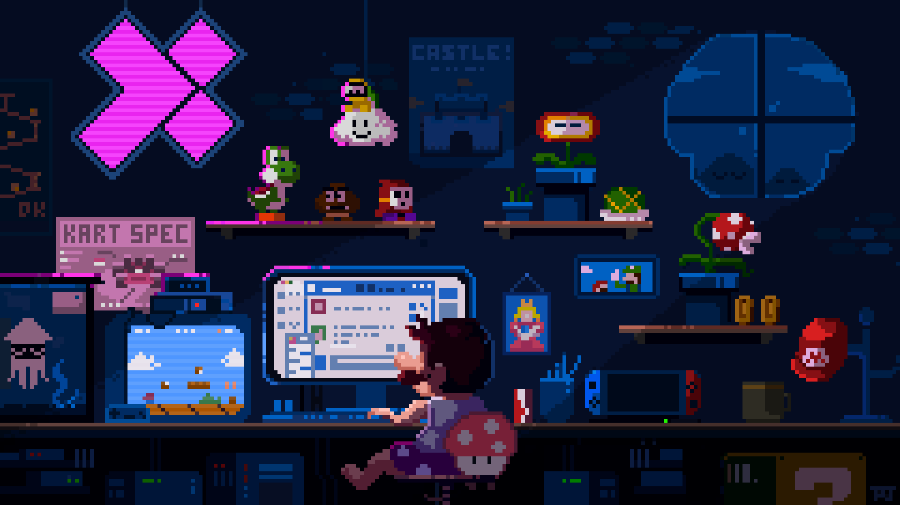

<h1>Hello!</h1>

I'm a <b>Front-End Developer</b> who uses the latest technologies to build, maintain, host, audit, and rework websites. As a freelancer, I focus on creating fast, modern, and user-friendly experiences for businesses of all sizes. I’m passionate about clean code, solving challenging problems, and constantly improving my craft. Outside of work, I enjoy gaming, watching anime, and diving into creative side projects.

 

<!---
V-Carames/V-Carames is a ✨ special ✨ repository because its `README.md` (this file) appears on your GitHub profile.
You can click the Preview link to take a look at your changes.

- 👋 Hi, I’m @V-Carames
- 👀 I’m interested in ...
- 🌱 I’m currently learning ...
- 💞️ I’m looking to collaborate on ...
- 📫 How to reach me ...
- 😄 Pronouns: ...
- ⚡ Fun fact: ...
--->
